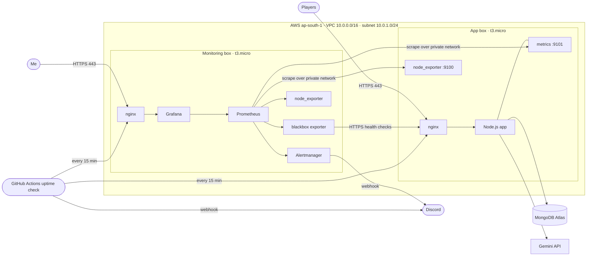
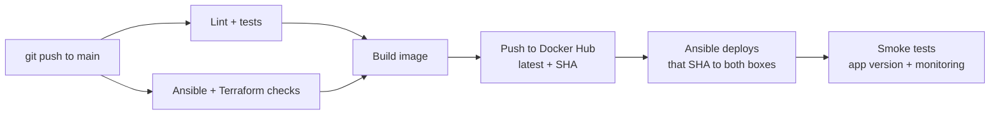
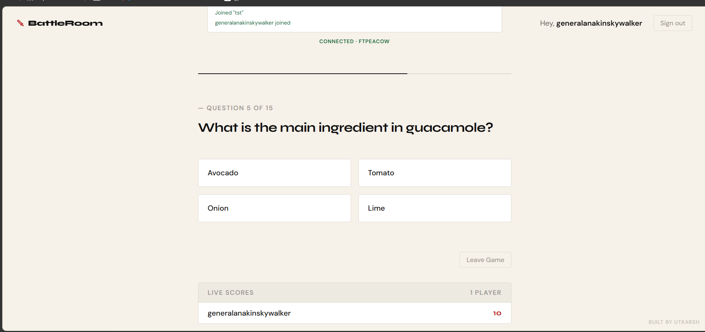
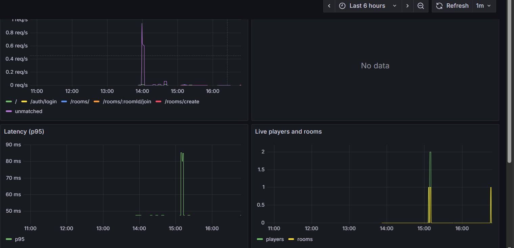
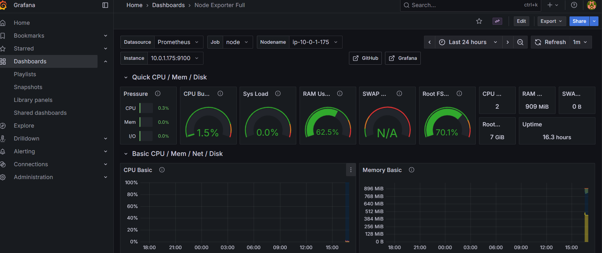
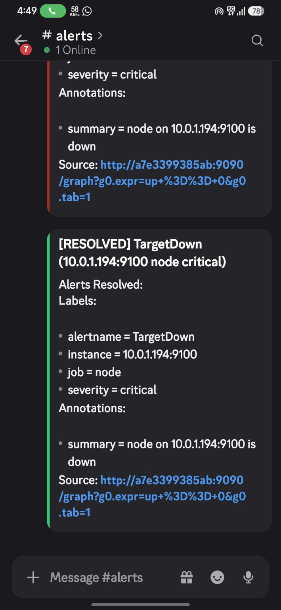
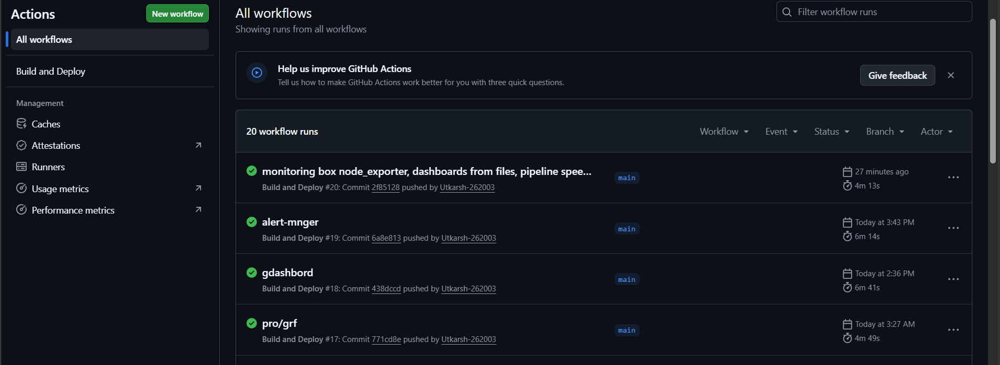

# BattleRoom ⚔️

A real-time multiplayer quiz game, deployed on AWS with a fully automated pipeline, HTTPS, and a separate monitoring server with dashboards and alerts.

Every push to `main` builds the app, deploys it to AWS, and checks the live site is healthy. Nobody touches a server by hand.

- **Live game:** https://battleroom.utkarshtyagi.in
- **Monitoring (Grafana):** https://grafana.utkarshtyagi.in (login required; see screenshots below)

---

## Contents

- [Architecture](#architecture)
- [The application](#the-application)
- [AWS infrastructure](#aws-infrastructure)
- [Terraform](#terraform)
- [Ansible](#ansible)
- [Docker and Compose](#docker-and-compose)
- [HTTPS](#https)
- [CI/CD pipeline](#cicd-pipeline)
- [Monitoring](#monitoring)
- [Alerting](#alerting)
- [Security](#security)
- [Failure scenarios](#failure-scenarios)
- [Design decisions](#design-decisions)
- [Repo layout](#repo-layout)
- [Run locally](#run-locally)
- [Known issues and next steps](#known-issues-and-next-steps)
- [Screenshots](#screenshots)

---

## Architecture



Two servers, one job each:

| | App box | Monitoring box |
|---|---|---|
| Job | Runs the game | Watches the app box and itself |
| Domain | `battleroom.utkarshtyagi.in` | `grafana.utkarshtyagi.in` |
| In Docker | app, nginx | Prometheus, Grafana, Alertmanager, blackbox exporter, nginx |
| On the host | node_exporter | node_exporter |

The monitoring runs on its own server for two reasons. The app box has 1 GB of memory, which is not enough for both. And a monitor has to survive the thing it monitors: if they shared a box and it died, the graphs would die with it.

---

## The application

Players sign up, create or join a room, and compete live on AI-generated questions. Each game picks random topics and asks Gemini for 15 fresh questions. Every player moves through the questions at their own pace, with a 15-second timer per question, and a live scoreboard shows everyone's score.

- **Backend:** Node.js, Express
- **Real-time:** Socket.io
- **Database:** MongoDB Atlas with Mongoose
- **Auth:** JWT and bcrypt
- **AI:** Google Gemini (`gemini-2.5-flash`) through the `@google/genai` SDK

**How a game works**

- A correct answer is worth 10 points, plus up to 10 more for answering fast.
- The waiting room lists who is there and who is host. Only the host can start.
- If the host leaves a waiting room and does not come back within 20 seconds, the next player becomes host.
- Gemini must return a fixed JSON shape (a response schema). The server then shuffles each question's options itself, because language models are bad at putting the right answer in a random position.
- If Gemini is busy (429 or 503), the request is retried twice with backoff. Each attempt has a 45-second timeout. If it still fails, everyone in the room is told and the host can press Start again.
- The all-time leaderboard (top 10) is shown in the lobby.

**Connections that drop**

If a player's connection drops mid-game, they have 20 seconds to come back. Socket.io reconnects on its own, and the server sends them the question they were on, with the time that is left. A page refresh works the same way, because the login and the current room are kept in `sessionStorage` for that tab. After 20 seconds away, the player counts as finished and the game goes on without them.

**Rooms**

Rooms move through `waiting`, `in-progress` and `finished`. Game state lives in memory during play; results are written to MongoDB when the game ends and feed the leaderboard. The newest 5 finished rooms are kept. A waiting room that nobody has been in for 2 minutes is deleted, so the lobby does not fill with dead rooms.

**Health**

`/healthz` returns `200` with `{"status":"ok","db":true,"version":"<commit SHA>"}` when MongoDB is connected and `503` when it is not. The version lets the pipeline check that the live site runs the commit it just deployed. It sits before the rate limiter, so health checks are never throttled.

**Shutting down**

A deploy stops the old container with SIGTERM. The app tells players in a running game that the server is restarting, closes those rooms, and exits cleanly in under a second. Players in a waiting room reconnect on their own once the new container is up.

---

## AWS infrastructure

| Resource | Purpose |
|---|---|
| VPC `10.0.0.0/16`, subnet `10.0.1.0/24` | Private network for both boxes |
| Internet gateway and route table | Internet access |
| 2 × EC2 `t3.micro` (Ubuntu), 12 GB gp3 disk each | App box and monitoring box |
| 2 × Elastic IP | Fixed public IPs that survive box replacement, so DNS never breaks |
| 2 × security group | One per box (below) |

**Security groups:**

| Box | Port | Open to |
|---|---|---|
| App | 22, 80, 443 | Anywhere |
| App | 9100 (node_exporter), 9101 (app metrics) | Only the monitoring box's security group |
| Monitoring | 22, 80, 443 | Anywhere |

Both instances are configured to require IMDSv2, the token-based version of the EC2 metadata service. It blocks the classic trick of getting a server to fetch its own cloud credentials for an attacker. The setting changes in place on the next `terraform apply`, with no rebuild.

The metrics ports reference the monitoring **security group**, not an IP. Private IPs change when a box is rebuilt; the security group does not, so the rule keeps working.

---

## Terraform

All infrastructure is defined in `terraform/`. Terraform is run by hand only when infrastructure changes. It is deliberately not part of the pipeline: a normal push changes the app, not the infrastructure.

Any single box can be rebuilt from nothing without touching DNS:

```bash
terraform apply -replace=aws_instance.battleroom
```

The Elastic IP stays, the new box gets set up by the pipeline, and the site comes back on its own. This was tested end to end, including a fresh HTTPS certificate being issued automatically.

---

## Ansible

`ansible/playbook.yml` sets up both boxes from a bare Ubuntu install. It has two plays, one per box, and two roles they share:

- **`base`**: installs Docker, Compose, certbot and node_exporter. It grows the root partition to fill the disk (needed after the disk is made bigger in Terraform), prints the free disk and swap in every deploy log, and adds a 1 GB swap file (skipped if the disk has less than 3 GB free).
- **`certbot`**: gets a Let's Encrypt certificate for a domain and installs the hook that reloads nginx after each renewal.

**App box:** copies the Compose file, nginx config and app secrets; starts the containers with the exact image tag the pipeline passes in; cleans up old images; gets the HTTPS certificate.

**Monitoring box:** templates the Prometheus and Alertmanager configs; copies the blackbox exporter config; provisions Grafana's data source and dashboards from files; starts everything; gets Grafana's certificate.

A few details that matter:

- **Idempotent.** A second run with nothing new reports no changes. The Compose and image-cleanup steps only report a change when something was actually created, restarted or removed.
- **Handlers** reload nginx or restart a service only when its config actually changed.
- **No hardcoded private IPs.** The Prometheus config is a Jinja template filled in from Ansible facts, so a rebuilt box with a new private IP is picked up on the next run.
- **Fails loudly.** The monitoring play asserts that its required secrets are present before touching anything.
- **Secret files are locked down.** The app's `.env` and Grafana's `.env` are readable by root only. The Alertmanager config holds the Discord webhook URL, so only the user Alertmanager runs as can read it.
- **Linted.** `ansible-lint` passes at its strictest (`production`) profile, and CI checks it on every push.
- **Pinned and future-proof.** The pipeline runs a pinned `ansible-core` (2.21.4). Facts are read as `ansible_facts['...']`, and the old top-level fact variables are switched off in `ansible.cfg`, so the playbook will not break when ansible-core 2.24 removes them.

---

## Docker and Compose

The app image is built by the pipeline and pushed to Docker Hub twice: as `latest` and as the commit SHA. The build stamps the SHA into the image, and `/healthz` reports it.

Deploys use the SHA tag, never `latest`. `compose.prod.yaml` reads the tag from `IMAGE_TAG`, which the pipeline passes through Ansible. So a deploy always runs the image it built, and a rollback is a deploy of an older SHA. Run by hand without `IMAGE_TAG`, Compose falls back to `latest`.

Each box runs one Compose file:

- **App box** (`compose.prod.yaml`): the app and nginx. The app is only reachable through nginx, never directly. Metrics are served on a separate port, 9101.
- **Monitoring box** (`monitoring/compose.yaml`): Prometheus and Grafana bound to `127.0.0.1` only, Alertmanager and the blackbox exporter on the internal Docker network only, and nginx as the single public entry point.

The image contains only what the app needs to run: no tests, dev dependencies, infrastructure code or docs. It runs as the unprivileged `node` user.

Metrics history, Grafana data and Alertmanager state live in named volumes, so they survive container recreation.

---

## HTTPS

Both domains use Let's Encrypt certificates, issued and renewed automatically with certbot.

On a brand-new box there is a chicken-and-egg problem: nginx will not start if its HTTPS config points at certificate files that do not exist yet, but certbot needs nginx running on port 80 to prove domain ownership.

The fix is two nginx config files:

1. `http.conf` (port 80): serves the certbot challenge and redirects everything else to HTTPS. Needs no certificate.
2. `https.conf` (port 443): added only after the certificate exists, then nginx reloads.

Renewals run in the background. A deploy hook reloads nginx after each renewal so the new certificate is picked up.

---

## CI/CD pipeline



GitHub Actions, in `.github/workflows/docker.yml`:

1. **`test`:** ESLint, then the test suite (below). Also runs on pull requests.
2. **`infra-lint`:** `ansible-lint`, `terraform fmt -check` and `terraform validate`. Also runs on pull requests.
3. **`docker`** (waits for both): builds the image with layer caching and pushes it to Docker Hub.
4. **`deploy`** (waits for `docker`): installs the pinned `ansible-core`, writes the SSH key and environment file from secrets, runs the playbook against both boxes with `IMAGE_TAG` set to the commit SHA, then runs the smoke tests.

Nothing is built or deployed unless the tests pass.

**Smoke tests.** The app's `/healthz` must say `ok` and report the SHA that was just deployed. For the monitoring box, Grafana, Prometheus and Alertmanager must all answer. A green run means the new version is actually live.

**One deploy at a time.** The deploy job is in a `production` concurrency group, so a second push waits instead of running Ansible against the same boxes at the same time.

**Rollback.** In GitHub, go to Actions → Build and Deploy → Run workflow, and enter the commit SHA to go back to. That skips the tests and the build, checks the image exists on Docker Hub, and deploys it. It works even when the newest code is broken.

**Tests.** `npm test` starts the real app against an in-memory MongoDB, with Gemini replaced by a local fake. It covers:

- malformed and flooding socket messages (the server must stay up),
- sockets and requests with missing, forged or unsigned tokens,
- a full two-player game, including scoring, the answer shuffle, and the saved leaderboard,
- dropping and resuming a connection mid-game, and staying away past the grace period,
- host handover and cleanup of abandoned rooms,
- Gemini being busy (retried) and down (players told),
- a clean shutdown on SIGTERM,
- signup rules and login rate limits.

Secrets are stored as GitHub Actions secrets and never committed: Docker Hub credentials, the SSH key, the app's environment file, the Grafana admin password, and the Discord webhook. They are passed to steps as environment variables and written with `printf`, so special characters inside them are never interpreted by the shell.

**Uptime check.** A second workflow, `.github/workflows/uptime.yml`, runs every 15 minutes from GitHub's servers, outside AWS. It checks the game, Grafana, Prometheus and Alertmanager, with about two minutes of retries each so a deploy does not count as an outage. It posts to Discord once when something breaks and once when it recovers. This is what notices if the monitoring box itself dies.

---

## Monitoring

Prometheus scrapes these every 15 seconds:

| Job | Target | What |
|---|---|---|
| `node` | App box `:9100` | CPU, memory, disk, network |
| `node` | Monitoring box `:9100` | Same, for the monitoring box itself |
| `battleroom` | App box `:9101` | The app's own metrics |
| `blackbox` | The two public URLs | Whether each one answers `200` over HTTPS, and when its certificate expires |
| `prometheus`, `alertmanager` | Themselves | Whether the monitoring stack is healthy |

The first three go over the private network. The `blackbox` job visits `https://battleroom.utkarshtyagi.in/healthz` and `https://grafana.utkarshtyagi.in/api/health` the way a player would. That catches problems the app's own metrics cannot see: nginx down, MongoDB down (`/healthz` returns `503`), DNS broken, or a certificate about to expire.

**App metrics** follow the four golden signals, using `prom-client`:

| Signal | Metric |
|---|---|
| Traffic | `http_requests_total` by method, route and status |
| Errors | Share of requests with a 5xx status |
| Latency | `http_request_duration_seconds` histogram (p95 on the dashboard) |
| Saturation | Live WebSocket connections, active game rooms, Node.js event loop lag |

There is also `question_generations_total` by outcome. Games start over WebSockets, so a failing Gemini API would otherwise never show up in the HTTP error rate.

Routes are labelled by pattern (`/rooms/:id`), never by raw URL, so room IDs cannot blow up the number of stored series.

**Grafana** is fully provisioned from files in `monitoring/grafana/`: the Prometheus data source and two dashboards. The app dashboard shows the golden signals, the health checks, certificate days left, and question generation. The second dashboard is Node Exporter Full, for both boxes. A rebuilt monitoring box comes up with everything already in place, nothing clicked by hand.

---

## Alerting

Alert rules live in `monitoring/prometheus/alerts.yml`. Alertmanager sends them to a Discord channel.

| Alert | Condition | Fires after |
|---|---|---|
| `TargetDown` | Any scrape target stops answering | 1 minute |
| `EndpointDown` | A public URL fails its health check (includes MongoDB down) | 2 minutes |
| `HighErrorRate` | More than 5% of requests return 5xx, and at least 4 of them | 5 minutes |
| `SlowResponses` | p95 response time above 1 second, with real traffic | 10 minutes |
| `QuestionGenerationFailing` | Gemini failed 3 or more times in 15 minutes | at once |
| `CertificateExpiringSoon` | An HTTPS certificate has less than 14 days left (renewal starts at 30) | 1 hour |
| `DiskAlmostFull` | Disk above 85% on any box | 5 minutes |
| `MemoryAlmostFull` | Memory above 90% on any box | 5 minutes |

The waiting periods filter out short spikes. The minimum-traffic conditions stop one failed request on a quiet site from looking like a 50% error rate. Related alerts are grouped into one message, unresolved problems are repeated every 4 hours, and a "resolved" message is sent when things recover.

Tested by stopping node_exporter on the app box: the alert arrived in Discord about two minutes later, and the resolved message followed after restarting it.

If the monitoring box itself goes down, none of this can fire. The uptime check in GitHub Actions (see [CI/CD pipeline](#cicd-pipeline)) covers that case and posts to the same Discord channel.

---

## Security

**Infrastructure**

- Only ports 22, 80 and 443 are public. Metrics ports only accept the monitoring server.
- Prometheus and Grafana are bound to `127.0.0.1`; Prometheus is never exposed publicly. Only its `/-/healthy` check is reachable, through an exact-match nginx route used by the uptime check. Grafana is reachable only through nginx with HTTPS and a login.
- Both instances are configured to require IMDSv2 (applied on the next `terraform apply`).
- SSH is key-only. Once `ansible/known_hosts` is committed, the pipeline refuses to connect to a server whose identity changed (see [Known issues](#known-issues-and-next-steps)).
- All secrets come from GitHub Actions secrets. On the servers, the `.env` files are readable by root only, and the Alertmanager config (which holds the Discord webhook) only by the user Alertmanager runs as.
- The Grafana admin password is set from a secret; the default `admin/admin` does not work.

**Application**

- JWT verified on every protected route and every socket connection, with the algorithm pinned to HS256. The username always comes from the verified token.
- Sockets without a valid token are refused before they connect.
- Every socket message is checked before use. A handler can never crash the server: anything it throws is logged and the message is dropped. Before this, `socket.emit('join-room', null)` from the browser console crashed the whole server.
- Each socket may send 50 messages per 10 seconds, and each message is capped at 16 KB.
- Room membership is checked against the database before a socket can join a room; only the host can start a game.
- Inputs are type-checked before reaching Mongoose, which blocks NoSQL operator injection like `{"$gt": ""}`.
- Signup checks usernames (3 to 20 letters, numbers, dots, dashes or underscores), email format, and length limits. Passwords over 72 bytes are refused, because bcrypt would silently ignore the rest.
- A failed login does the same bcrypt work whether or not the email exists, so response times do not reveal which accounts exist.
- User text is rendered with `textContent`, never `innerHTML`.
- Helmet sets CSP, HSTS and related headers; inline scripts are blocked.
- Rate limits per IP: 100 requests per 15 minutes overall; 10 **failed** logins per 15 minutes (successful ones do not count, so friends on one Wi-Fi are not locked out); 20 signups per hour.
- The lobby never receives other players' user IDs.
- Correct answers are never sent to the client before you answer; answers are validated server-side, one per player per question.
- Error responses are generic; details are logged server-side only.
- `/metrics` is not served by the public app at all.

---

## Failure scenarios

| What happens | What the system does |
|---|---|
| The app crashes | Docker restarts it (`restart: unless-stopped`). If it stays down, `TargetDown` and `EndpointDown` fire in Discord. |
| A player sends a malformed message | It is dropped and logged. The server keeps running. |
| A player's connection drops | They have 20 seconds to reconnect and carry on from the same question. |
| A bad commit is pushed | Lint and tests fail and nothing is built or deployed. If a bug gets past them, the smoke test goes red; roll back with Run workflow and an older SHA. |
| Two pushes land close together | The second deploy waits for the first. |
| A deploy happens mid-game | Players are told the server is restarting; the room is closed. Waiting rooms reconnect on their own. |
| Gemini is busy | The request is retried twice with backoff. If it still fails, players are told and the host can try again. `QuestionGenerationFailing` fires if it keeps happening. |
| A box dies | `terraform apply -replace=...`, then re-run the pipeline. The Elastic IP keeps DNS working and Ansible rebuilds everything, including the certificate. |
| The monitoring box dies | Prometheus cannot alert, but the uptime check in GitHub Actions posts to Discord within about 15 minutes. |
| The disk fills up | Old images are pruned on every deploy. If it still passes 85%, `DiskAlmostFull` fires. |
| Memory runs low | The swap file absorbs short spikes. `MemoryAlmostFull` fires at 90%. |
| MongoDB goes down | `/healthz` returns `503`, so `EndpointDown` fires within about 2 minutes. |
| A certificate stops renewing | certbot renews at 30 days left. If that fails, `CertificateExpiringSoon` fires at 14 days. |
| A server restarts | Docker brings every container back on its own. |

---

## Design decisions

- **Separate monitoring server** for memory headroom and failure isolation.
- **Security group references over IP rules**, because private IPs change on rebuild.
- **Elastic IPs**, so rebuilding a box never touches DNS.
- **Terraform outside the pipeline**, because pushes change the app, not the infrastructure, and the state file must stay safe.
- **node_exporter on the host, not in Docker**, so it sees the whole machine.
- **Pull-based monitoring**, so the app needs no knowledge of monitoring, and a silent target is itself a signal.
- **Metrics on a separate port**, so nginx can never expose them.
- **Prometheus rules over Grafana alerting**, so alert rules live in the repo and survive rebuilds.
- **Everything as files**, including Grafana's data source and dashboards, so either server can be rebuilt from the repo alone.
- **GitHub Actions instead of Jenkins**, to avoid running and securing another server for CI.
- **Deploy by commit SHA, not `latest`**, so a deploy runs exactly what was built and tested, and rollback is just another deploy.
- **Health checks from outside as well as inside**, because the app's own metrics stay green when nginx, DNS, MongoDB or a certificate is the problem, and nothing inside AWS can report the monitoring box's own death.
- **Tests against the real app process**, with only Gemini faked, so they exercise the same code, sockets and database queries as production.

---

## Repo layout

```
.
├── .github/workflows/
│   ├── docker.yml                   # CI/CD pipeline
│   └── uptime.yml                   # Outside uptime check, every 15 min
├── terraform/                       # AWS infrastructure
├── ansible/
│   ├── playbook.yml                 # Sets up both servers
│   ├── roles/base/                  # Docker, node_exporter, swap
│   ├── roles/certbot/               # HTTPS certificate + renewal hook
│   ├── inventory.ini
│   ├── ansible.cfg
│   └── files/                       # certbot renewal hooks
├── nginx/                           # App box nginx (http.conf, https.conf)
├── compose.prod.yaml                # App box containers
├── monitoring/
│   ├── compose.yaml                 # Monitoring box containers
│   ├── prometheus.yml.j2            # Scrape config (templated by Ansible)
│   ├── prometheus/alerts.yml        # Alert rules
│   ├── alertmanager/                # Alertmanager config (templated)
│   ├── blackbox/                    # Health check module for the public URLs
│   ├── grafana/                     # Data source, dashboard provider, dashboards
│   └── nginx/                       # Monitoring box nginx
├── app.js                           # App entry point: Express, servers, shutdown
├── lib/
│   ├── game.js                      # Sockets and game logic
│   ├── questions.js                 # Gemini question generation
│   └── metrics.js                   # Prometheus metrics
├── routes/  models/  middleware/
├── public/                          # index.html and the browser script
├── test/                            # End-to-end and unit tests
└── Dockerfile
```

---

## Run locally

Requires Node.js 20.19 or newer.

```bash
git clone https://github.com/Utkarsh-262003/battleroom.git
cd battleroom
npm install
```

Create a `.env` file in the project root:

```
MONGO_URI=your_mongodb_connection_string
JWT_SECRET=your_jwt_secret
GEMINI_API_KEY=your_gemini_api_key
PORT=3000
```

All four are required. If any is missing, the app exits at startup and names the missing ones.

```bash
npm start        # production
npm run dev      # nodemon, restarts on change
```

Metrics are served locally at `http://localhost:9101/metrics`.

To check your changes the same way CI does:

```bash
npm run lint
npm test         # starts the real app against an in-memory MongoDB; no .env needed
```

The first `npm test` downloads a MongoDB binary, so it takes a little longer.

---

## Known issues and next steps

- **SSH host keys are not pinned yet.** The pipeline cannot check it is talking to the real servers until their host keys are in the repo. From a machine that can reach them, run this once and push the file:

  ```bash
  ssh-keyscan 13.201.197.217 15.252.59.161 > ansible/known_hosts
  ```

  From then on, the deploy refuses to connect if a server's identity changes. After rebuilding a box with `terraform apply -replace`, run the command again for its IP.
- **One `terraform apply` is waiting.** IMDSv2 and the bigger 12 GB disks are in the Terraform code, but Terraform is run by hand, so they reach AWS the next time you run `terraform apply` in `terraform/`. Both change the instances in place. Before typing `yes`, check the plan says `2 to change, 0 to destroy`. Then run the pipeline once (Actions → Build and Deploy → Run workflow): Ansible grows the partitions to the new size and adds the swap file.
- **In-memory game state.** A restart ends any game in progress. Players are told, and the room is closed, but the round is lost. Keeping game state in Redis would let games survive a deploy.
- **Terraform state is local.** Moving it to S3 with locking would let the pipeline and others use it safely.
- **Root disks are not encrypted.** Turning on EBS encryption for an existing instance means replacing it, so it is best done at the next planned rebuild.
- **The uptime check runs on GitHub's schedule.** Scheduled runs can start a few minutes late, and GitHub pauses them after 60 days without any activity in the repository.

---

## Screenshots

| | |
|---|---|
| **Game**  | **App dashboard**  |
| **Box dashboard**  | **Discord alert**  |
| **Pipeline run**  | |


----UTKARSH TYAGI