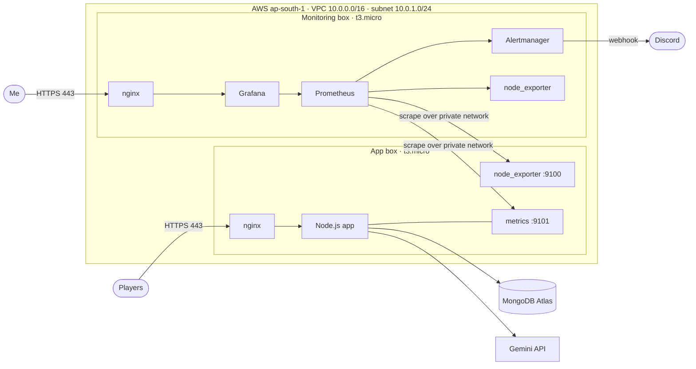
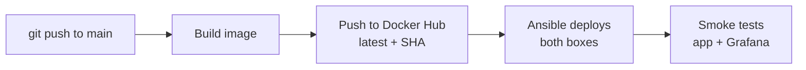

# BattleRoom ⚔️

A real-time multiplayer quiz game, deployed on AWS with a fully automated pipeline, HTTPS, and a separate monitoring server with dashboards and alerts.

Every push to `main` builds the app, deploys it to AWS, and checks the live site is healthy. Nobody touches a server by hand.

- **Live game:** https://battleroom.utkarshtyagi.in
- **Monitoring (Grafana):** https://grafana.utkarshtyagi.in (login required; see screenshots below)

---

## Contents

- [Architecture](#architecture)
- [The application](#the-application)
- [AWS infrastructure](#aws-infrastructure)
- [Terraform](#terraform)
- [Ansible](#ansible)
- [Docker and Compose](#docker-and-compose)
- [HTTPS](#https)
- [CI/CD pipeline](#cicd-pipeline)
- [Monitoring](#monitoring)
- [Alerting](#alerting)
- [Security](#security)
- [Failure scenarios](#failure-scenarios)
- [Design decisions](#design-decisions)
- [Repo layout](#repo-layout)
- [Run locally](#run-locally)
- [Known issues and next steps](#known-issues-and-next-steps)
- [Screenshots](#screenshots)

---

## Architecture



Two servers, one job each:

| | App box | Monitoring box |
|---|---|---|
| Job | Runs the game | Watches the app box and itself |
| Domain | `battleroom.utkarshtyagi.in` | `grafana.utkarshtyagi.in` |
| In Docker | app, nginx | Prometheus, Grafana, Alertmanager, nginx |
| On the host | node_exporter | node_exporter |

The monitoring runs on its own server for two reasons. The app box has 1 GB of memory, which is not enough for both. And a monitor has to survive the thing it monitors: if they shared a box and it died, the graphs would die with it.

---

## The application

Players sign up, create or join a room, and compete live on AI-generated questions. Each game picks random topics and asks Gemini for 15 fresh questions. Every player moves through the questions at their own pace, with a 15-second timer per question, and a live scoreboard shows everyone's score.

- **Backend:** Node.js, Express
- **Real-time:** Socket.io
- **Database:** MongoDB Atlas with Mongoose
- **Auth:** JWT and bcrypt
- **AI:** Google Gemini (`gemini-2.5-flash`)

Rooms move through `waiting`, `in-progress` and `finished`. Game state lives in memory during play; results are written to MongoDB when the game ends and feed a persistent leaderboard. Old finished rooms are pruned automatically.

The app exposes `/healthz`, which returns `200` with `{"status":"ok","db":true}` when MongoDB is connected and `503` when it is not. It sits before the rate limiter, so health checks are never throttled.

---

## AWS infrastructure

| Resource | Purpose |
|---|---|
| VPC `10.0.0.0/16`, subnet `10.0.1.0/24` | Private network for both boxes |
| Internet gateway and route table | Internet access |
| 2 × EC2 `t3.micro` (Ubuntu) | App box and monitoring box |
| 2 × Elastic IP | Fixed public IPs that survive box replacement, so DNS never breaks |
| 2 × security group | One per box (below) |

**Security groups:**

| Box | Port | Open to |
|---|---|---|
| App | 22, 80, 443 | Anywhere |
| App | 9100 (node_exporter), 9101 (app metrics) | Only the monitoring box's security group |
| Monitoring | 22, 80, 443 | Anywhere |

The metrics ports reference the monitoring **security group**, not an IP. Private IPs change when a box is rebuilt; the security group does not, so the rule keeps working.

---

## Terraform

All infrastructure is defined in `terraform/`. Terraform is run by hand only when infrastructure changes. It is deliberately not part of the pipeline: a normal push changes the app, not the infrastructure.

Any single box can be rebuilt from nothing without touching DNS:

```bash
terraform apply -replace=aws_instance.battleroom
```

The Elastic IP stays, the new box gets set up by the pipeline, and the site comes back on its own. This was tested end to end, including a fresh HTTPS certificate being issued automatically.

---

## Ansible

`ansible/playbook.yml` sets up both boxes from a bare Ubuntu install. It has two plays, one per box.

**App box:** installs Docker, Compose, certbot and node_exporter; copies the Compose file, nginx config and app secrets; starts the containers; cleans up old images; gets and renews the HTTPS certificate.

**Monitoring box:** installs the same base; templates the Prometheus and Alertmanager configs; provisions Grafana's data source and dashboards from files; starts Prometheus, Grafana, Alertmanager and nginx; gets and renews Grafana's certificate.

A few details that matter:

- **Idempotent.** A second run changes nothing except the Compose command.
- **Handlers** reload nginx or restart a service only when its config actually changed.
- **No hardcoded private IPs.** The Prometheus config is a Jinja template filled in from Ansible facts, so a rebuilt box with a new private IP is picked up on the next run.
- **Fails loudly.** The monitoring play asserts that its required secrets are present before touching anything.

---

## Docker and Compose

The app image is built by the pipeline and pushed to Docker Hub twice: as `latest` and as the commit SHA. The SHA tags are a permanent history of every version shipped, used for rollback.

Each box runs one Compose file:

- **App box** (`compose.prod.yaml`): the app and nginx. The app is only reachable through nginx, never directly. Metrics are served on a separate port, 9101.
- **Monitoring box** (`monitoring/compose.yaml`): Prometheus and Grafana bound to `127.0.0.1` only, Alertmanager on the internal Docker network only, and nginx as the single public entry point.

Metrics history, Grafana data and Alertmanager state live in named volumes, so they survive container recreation.

---

## HTTPS

Both domains use Let's Encrypt certificates, issued and renewed automatically with certbot.

On a brand-new box there is a chicken-and-egg problem: nginx will not start if its HTTPS config points at certificate files that do not exist yet, but certbot needs nginx running on port 80 to prove domain ownership.

The fix is two nginx config files:

1. `http.conf` (port 80): serves the certbot challenge and redirects everything else to HTTPS. Needs no certificate.
2. `https.conf` (port 443): added only after the certificate exists, then nginx reloads.

Renewals run in the background. A deploy hook reloads nginx after each renewal so the new certificate is picked up.

---

## CI/CD pipeline



GitHub Actions, in `.github/workflows/docker.yml`:

1. **`docker` job:** builds the image and pushes it to Docker Hub.
2. **`deploy` job** (waits for `docker`): installs Ansible, writes the SSH key and environment file from secrets, runs the playbook against both boxes, then checks `https://battleroom.utkarshtyagi.in/healthz` and `https://grafana.utkarshtyagi.in/api/health` with retries.

A green run means the site is actually up, not just that the deploy script finished.

Secrets are stored as GitHub Actions secrets and never committed: Docker Hub credentials, the SSH key, the app's environment file, the Grafana admin password, and the Discord webhook. They are passed to steps as environment variables and written with `printf`, so special characters inside them are never interpreted by the shell.

---

## Monitoring

Prometheus scrapes three targets every 15 seconds over the private network:

| Job | Target | What |
|---|---|---|
| `node` | App box `:9100` | CPU, memory, disk, network |
| `node` | Monitoring box `:9100` | Same, for the monitoring box itself |
| `battleroom` | App box `:9101` | The app's own metrics |

**App metrics** follow the four golden signals, using `prom-client`:

| Signal | Metric |
|---|---|
| Traffic | `http_requests_total` by method, route and status |
| Errors | Share of requests with a 5xx status |
| Latency | `http_request_duration_seconds` histogram (p95 on the dashboard) |
| Saturation | Live WebSocket connections, active game rooms, Node.js event loop lag |

Routes are labelled by pattern (`/rooms/:id`), never by raw URL, so room IDs cannot blow up the number of stored series.

**Grafana** is fully provisioned from files in `monitoring/grafana/`: the Prometheus data source and two dashboards (the app's golden signals, and Node Exporter Full for both boxes). A rebuilt monitoring box comes up with everything already in place, nothing clicked by hand.

---

## Alerting

Alert rules live in `monitoring/prometheus/alerts.yml`. Alertmanager sends them to a Discord channel.

| Alert | Condition | Fires after |
|---|---|---|
| `TargetDown` | Any scrape target stops answering | 1 minute |
| `DiskAlmostFull` | Disk above 85% on any box | 5 minutes |
| `MemoryAlmostFull` | Memory above 90% on any box | 5 minutes |

The waiting periods filter out short spikes. Related alerts are grouped into one message, unresolved problems are repeated every 4 hours, and a "resolved" message is sent when things recover.

Tested by stopping node_exporter on the app box: the alert arrived in Discord about two minutes later, and the resolved message followed after restarting it.

---

## Security

**Infrastructure**

- Only ports 22, 80 and 443 are public. Metrics ports only accept the monitoring server.
- Prometheus and Grafana are bound to `127.0.0.1`; Prometheus is never exposed publicly. Grafana is reachable only through nginx with HTTPS and a login.
- SSH is key-only.
- All secrets come from GitHub Actions secrets; secret files on the servers are readable by root only.
- The Grafana admin password is set from a secret; the default `admin/admin` does not work.

**Application**

- JWT verified on every protected route and every socket connection; the username always comes from the verified token.
- Room membership is checked against the database before a socket can join a room; only the host can start a game.
- Inputs are type-checked before reaching Mongoose, which blocks NoSQL operator injection like `{"$gt": ""}`.
- User text is rendered with `textContent`, never `innerHTML`.
- Helmet sets CSP, HSTS and related headers; inline scripts are blocked.
- Rate limits: 100 requests per 15 minutes per IP, 10 on `/auth`.
- Correct answers are never sent to the client; answers are validated server-side, one per player per question.
- Error responses are generic; details are logged server-side only.
- `/metrics` is not served by the public app at all.

---

## Failure scenarios

| What happens | What the system does |
|---|---|
| The app crashes | Docker restarts it (`restart: unless-stopped`). If it stays down, `TargetDown` fires in Discord. |
| A bad commit is pushed | The smoke test fails and the pipeline goes red. Roll back by deploying an older SHA tag. |
| A box dies | `terraform apply -replace=...`, then re-run the pipeline. The Elastic IP keeps DNS working and Ansible rebuilds everything, including the certificate. |
| The disk fills up | Old images are pruned on every deploy. If it still passes 85%, `DiskAlmostFull` fires. |
| Memory runs low | `MemoryAlmostFull` fires at 90%. |
| MongoDB goes down | `/healthz` returns `503`, so health checks and smoke tests fail. |
| A certificate nears expiry | certbot renews it automatically and the deploy hook reloads nginx. |
| A server restarts | Docker brings every container back on its own. |

---

## Design decisions

- **Separate monitoring server** for memory headroom and failure isolation.
- **Security group references over IP rules**, because private IPs change on rebuild.
- **Elastic IPs**, so rebuilding a box never touches DNS.
- **Terraform outside the pipeline**, because pushes change the app, not the infrastructure, and the state file must stay safe.
- **node_exporter on the host, not in Docker**, so it sees the whole machine.
- **Pull-based monitoring**, so the app needs no knowledge of monitoring, and a silent target is itself a signal.
- **Metrics on a separate port**, so nginx can never expose them.
- **Prometheus rules over Grafana alerting**, so alert rules live in the repo and survive rebuilds.
- **Everything as files**, including Grafana's data source and dashboards, so either server can be rebuilt from the repo alone.
- **GitHub Actions instead of Jenkins**, to avoid running and securing another server for CI.

---

## Repo layout

```
.
├── .github/workflows/docker.yml     # CI/CD pipeline
├── terraform/                       # AWS infrastructure
├── ansible/
│   ├── playbook.yml                 # Sets up both servers
│   ├── inventory.ini
│   ├── ansible.cfg
│   └── files/                       # certbot renewal hooks
├── nginx/                           # App box nginx (http.conf, https.conf)
├── compose.prod.yaml                # App box containers
├── monitoring/
│   ├── compose.yaml                 # Monitoring box containers
│   ├── prometheus.yml.j2            # Scrape config (templated by Ansible)
│   ├── prometheus/alerts.yml        # Alert rules
│   ├── alertmanager/                # Alertmanager config (templated)
│   ├── grafana/                     # Data source, dashboard provider, dashboards
│   └── nginx/                       # Monitoring box nginx
├── app.js                           # App entry point
├── routes/  models/  middleware/  public/
└── Dockerfile
```

---

## Run locally

Requires Node.js 20.19 or newer.

```bash
git clone https://github.com/Utkarsh-262003/battleroom.git
cd battleroom
npm install
```

Create a `.env` file in the project root:

```
MONGO_URI=your_mongodb_connection_string
JWT_SECRET=your_jwt_secret
GEMINI_API_KEY=your_gemini_api_key
PORT=3000
```

All four are required. If any is missing, the app exits at startup and names the missing ones.

```bash
npm start        # production
npm run dev      # nodemon, restarts on change
```

Metrics are served locally at `http://localhost:9101/metrics`.

---

## Known issues and next steps

- **No retry when Gemini is busy.** Under load it can return `503`; the host has to press Start again. Retry with backoff is the fix.
- **In-memory game state.** A restart mid-game loses the round in progress. Rooms stuck in progress are marked finished on startup.
- **No swap on the app box.** Adding a small swap file would soften memory spikes.
- **Terraform state is local.** Moving it to S3 with locking would let the pipeline and others use it safely.
- **Repeated certbot tasks** across both plays could become an Ansible role.

---

## Screenshots

| | |
|---|---|
| **Game**  | **App dashboard**  |
| **Box dashboard**  | **Discord alert**  |
| **Pipeline run**  | |